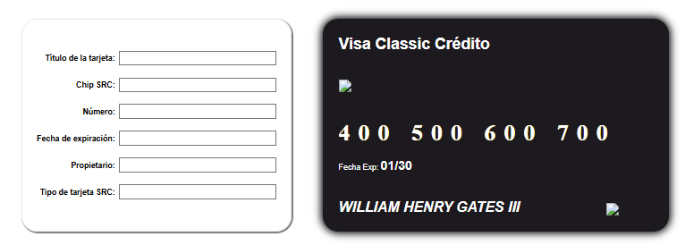

# **FORM BINDING CHALLENGE WITH VUE.JS**

This project demonstrates the use of two-way data binding in Vue.js to dynamically populate a user form and table in real time. The application includes a form for entering user information and a table that updates reactively with the form's data using Vue's `v-model` directive.

## **Technologies Used**
- **Vue.js**
- **JavaScript**
- **Bootstrap**
- **HTML5**
- **CSS3**

## **Features**
- **Dynamic Form Binding**: Uses `v-model` to bind form inputs, select elements, and radio buttons to a reactive state.
- **Real-Time Data Display**: Updates a table dynamically with user inputs.
- **Modular Design**: Employs Bootstrap's grid system for styling and Vue's component-based architecture.
- **Expandable Form**: Encourages adding fields like address, marital status, and continents visited.

## **Screenshots**
<p align="center">
  
</p>


## **Installation**
1.	Start proyect
```bash
npx vite

